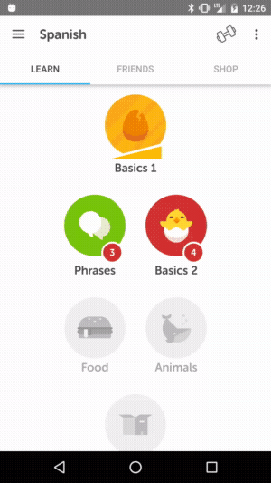

# RtlViewPager
`RtlViewPager` is built on top of `ViewPager` which is provided as part of the
[Android v4 Support Library](https://developer.android.com/topic/libraries/support-library/features.html#v4).
It extends the functionality of `ViewPager` such that when the layout direction is right to left, pages scroll accordingly.
`RtlViewPager` fully supports data set changes, interoperation with tab strips, and saving and restoring state on screen rotation
and other configuration changes.  Although RTL support has been present as part of Android since version 4.2, the `ViewPager`
implementation in the support library does not.

## Preview




## Usage
```groovy
dependencies {
    compile 'com.android.support:support-core-ui:<choose_your_version>'
    compile 'com.duolingo.open:rtl-viewpager:1.0.3'
}
```
[](https://bintray.com/duolingo/maven/RtlViewPager?source=watch)

## Contributing

Please read our [contributing guidelines](CONTRIBUTING.md).

## License

> Copyright 2016 Duolingo
>
> Licensed under the Apache License, Version 2.0 (the "License");
you may not use this file except in compliance with the License.
You may obtain a copy of the License at
>
> http://www.apache.org/licenses/LICENSE-2.0
>
> Unless required by applicable law or agreed to in writing, software
distributed under the License is distributed on an "AS IS" BASIS,
WITHOUT WARRANTIES OR CONDITIONS OF ANY KIND, either express or implied.
See the License for the specific language governing permissions and
limitations under the License.

A copy of the license is also available in the [license file](LICENSE).
